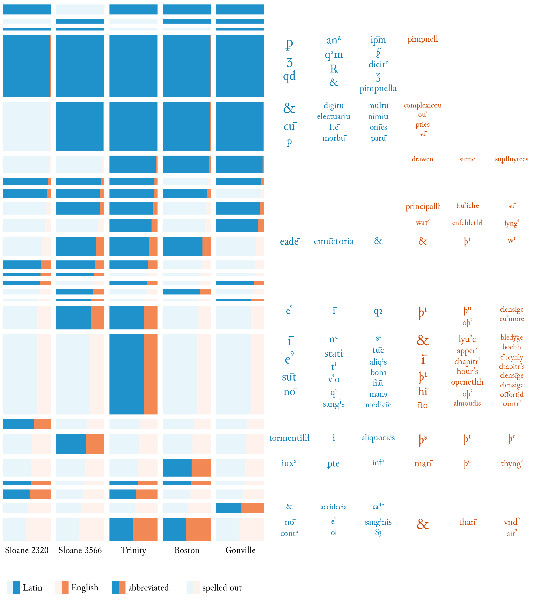

# Consistency of medieval abbreviation practices

This repository contains the source code accompanying the following
article:

* Alpo Honkapohja and Jukka Suomela: "Lexical and function words or
  language and text type? Abbreviation consistency in an aligned
  corpus of Latin and Middle English plague tracts", _Digital
  Scholarship in the Humanities_, to appear.

While a lot of this code is highly specific to the present study and
provided here primarily as a documentation of the research project, at
least some parts of it might be reusable in similar studies.

## High-level workflow

1. Input data: XML files with texts.

2. Automatic alignment: [`align.py`](alignment/align.py) generates an
   Excel file with the alignment results.

3. Manual alignment: the Excel file is edited to correct mistakes in
   the automatic alignment.

4. Annotation of abbreviations: the Excel file is edited to classify
   abbreviations (e.g. lexical vs. function words).

5. Parsing results: [`extract.py`](parsing/extract.py) reads the XML
   files and the edited Excel file, and creates a JSON file with a
   machine-readable representation of the data (one record = one
   aligned, annotated word).

6. Clustering words: [`freq.py`](parsing/freq.py) groups together
   words that are spelling variants of the same word, and calculates
   the frequency of each word (across all spelling variants) and
   stores also this information in a JSON file.

7. Visualization.

## Code

* `alignment`: automatic alignment of the texts

  - [`align.py`](alignment/align.py):
    try to align the texts automatically.
    - Input: XML files.
    - Output: Excel file `jburgundy.xlsx`.

  - [`align-explain.py`](alignment/align-explain.py):
    as above, but produce additional output.

* `parsing`: parsing the results

  - [`extract.py`](parsing/extract.py):
    Read the manual annotations and turn the alignment results into a
    machine-readable JSON file.
    - Input: XML files and the annotated version of `jburgundy.xlsx`.
    - Output: JSON file `extract.json`.

  - [`freq.py`](parsing/freq.py):
    Cluster together spelling variants of the same word and calculate
    the frequencies.
    - Input: JSON file `extract.json`.
    - Output: JSON file `extract2.json`, and plain text to standard
      output.

* `misc`: miscellaneous tools

  - [`outline.py`](misc/outline.py):
    print out the structure of each XML file.
    - Input: XML files.
    - Output: plain text to standard output.

  - [`pairs.py`](misc/pairs.py) and
    [`pairs-confidence.py`](misc/pairs-confidence.py):
    calculate human-readable tables that show the consistency of
    abbreviation practices across different texts.
    - Input: JSON file `extract2.json`
    - Output: HTML files

## Contact and copyright

* Jukka Suomela, https://jukkasuomela.fi/

## License

* [MIT License](LICENSE)

## Sample output

